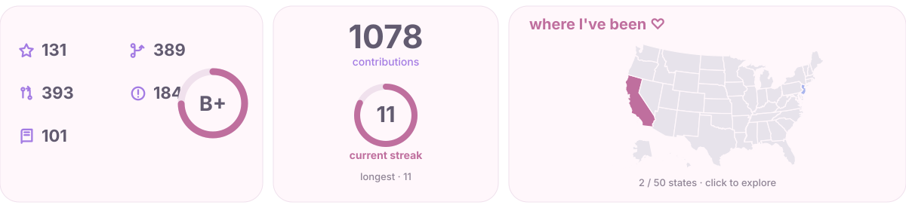

<div align="center">


<picture>
  <source media="(prefers-color-scheme: dark)" srcset="./assets/mika-about-dark.svg" />
  <source media="(prefers-color-scheme: light)" srcset="./assets/mika-about-light.svg" />
  
</picture>

<a href="https://mikamikasuki.github.io/mika/travel/" aria-label="Open the interactive travel map">
  <picture>
    <source media="(prefers-color-scheme: dark)" srcset="./assets/generated/profile-dark.svg" />
    <source media="(prefers-color-scheme: light)" srcset="./assets/generated/profile-light.svg" />
    
  </picture>
</a>

<a href="https://mikamikasuki.github.io/mika/travel/">Explore the interactive travel map →</a>

</div>

## Travel photo folders

The colored states and photos are marked as demo content. Put photos in the matching timezone and state folder; a state with at least one image is added to the map automatically. Add an entry in `travel-data.json` when you want to customize its subtitle, places, or note.

```text
docs/travel/photos/
├── Pacific/CA/
├── Eastern/NJ/
└── <time-zone>/<STATE_CODE>/
```

Use `.jpg`, `.jpeg`, `.png`, `.webp`, or `.gif` files. Numbered names such as `01.webp` keep photos in a predictable order; a descriptive filename becomes the photo caption. Remove the `*-demo.svg` illustrations when you add real photos.

The GitHub Pages site is public, so upload only photos you want to publish.

The state folders use each state’s main time zone. States with multiple time zones are assigned by their primary population center.

| Folder | State codes |
| --- | --- |
| `Pacific` | CA, NV, OR, WA |
| `Mountain` | AZ, CO, ID, MT, NM, UT, WY |
| `Central` | AL, AR, IA, IL, KS, LA, MN, MO, MS, ND, NE, OK, SD, TX, WI |
| `Eastern` | CT, DE, FL, GA, IN, KY, MA, MD, ME, MI, NC, NH, NJ, NY, OH, PA, RI, SC, TN, VA, VT, WV |
| `Alaska` | AK |
| `Hawaii` | HI |

After adding a state or photo, the Pages workflow rebuilds the map and gallery. Run `npm ci && npm run build` to refresh the profile card SVGs; the scheduled workflow also refreshes live GitHub statistics each day.

## Run the demo locally

```sh
npm ci
npm run build
python3 -m http.server 8000 --directory docs
```

Open `http://localhost:8000/`. Without `GITHUB_TOKEN`, the profile cards use the sample values shown in the design.
